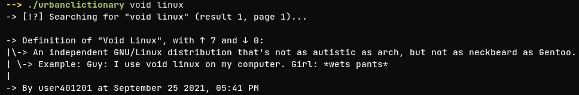
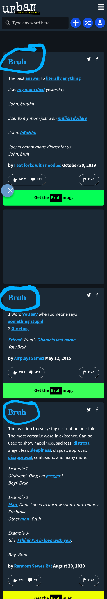
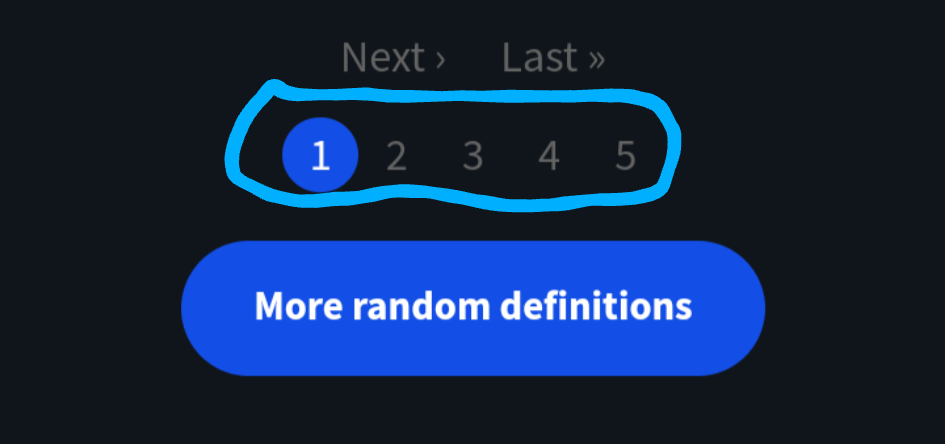

# urbanclictionary, a cli program for urban dictionary

using [**api.urbanictionary.com**](https://api.urbandictionary.com/v0/) and [requests](https://github.com/psf/requests)

for more click [here](screenshots.md)

## help and usage

running urbanclictionary (`./urbanclictionary`) without any options will print the help menu

Usage: `./urbanclictionary WORD RESULT_NUMBER %PAGE_NUMBER`

WORD is **required**, RESULT_NUMBER and PAGE_NUMBER are **optional**

where word is the word you want to look for, 

result is the definition you want
,

and page is well, the page
